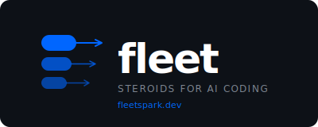
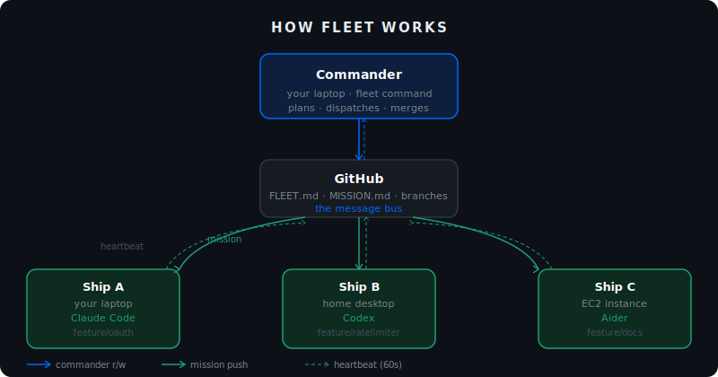
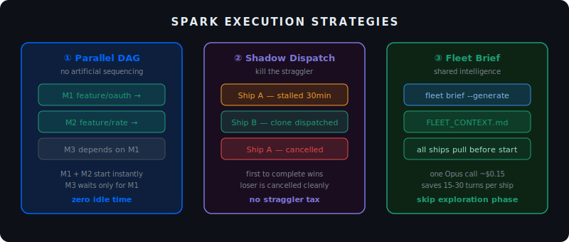
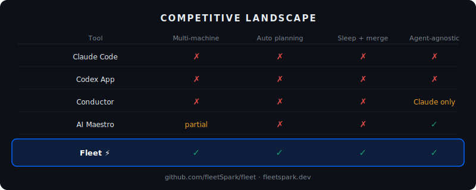

# fleet ⚡

**Steroids for AI coding.**

Your laptop is running Claude Code. Your desktop is idle. Your EC2 from last sprint is still running.

Three machines. One codebase. None of them coordinated.

**Fleet fixes that.**

One command makes any machine a commander. One command on any other machine joins the fleet. Every ship gets a mission, runs an agent on its own branch, pushes progress as it goes. The commander watches, unblocks, retries, and merges — while you sleep.

Works with Claude Code, Codex, Aider, or any A2A agent. GitHub is the bus. No SSH. No shared filesystem. No infrastructure.

```bash
npx fleet init
npx fleet command --plan "your goal here"
```

On any other machine:

```bash
npx fleet ship --join git@github.com:you/your-repo.git
```

---

## How it works

Fleet is architecturally a Map-Reduce system for software development.





## Spark execution strategies



## Architecture



**Map:** Each ship (worker machine) independently executes its mission on its own git branch. Ships never talk to each other — only to GitHub.

**Reduce:** The commander collects completed branches, validates them, and merges into main.

**GitHub is the message bus.** No IP addresses. No SSH tunnels. No firewall rules. If a machine can push to GitHub, it can join the fleet.

```
Your laptop (commander)
    │
    ├── reads/writes FLEET.md on main branch
    │
GitHub (message bus)
    │
    ├── Machine B pulls mission → feature/auth
    ├── Machine C pulls mission → feature/ratelimiter  
    └── EC2 pulls mission       → feature/docs
```

---

## Spark execution

Fleet implements three speed optimisations from Apache Spark:

**Parallel DAG dispatch** — every mission with no dependencies starts immediately. Independent branches never wait for each other.

**Shadow dispatch** — stalled ship? Commander clones the mission to a spare machine. First to finish wins.

**Fleet brief** — one codebase analysis pass before missions start. Every ship skips the 15-30 turn exploration phase and executes immediately.

```yaml
execution:
  strategy: spark   # sequential | mapreduce | spark
```

---

## The protocol

Fleet coordinates through two plain Markdown files in your repo.

**`FLEET.md`** — lives on `main`. The commander writes it. All machines read it.

```markdown
# Fleet manifest
Updated: 2026-03-22T14:30Z

## Commander
host: macbook-prabu  |  status: active

## Active missions
| ID | Branch             | Ship   | Agent       | Status      |
|----|--------------------|--------|-------------|-------------|
| M1 | feature/auth       | ship-a | claude-code | in-progress |
| M2 | feature/ratelimiter| ship-b | codex       | in-progress |
| M3 | feature/docs       | ship-c | aider       | blocked     |

## Merge queue
- M2 feature/ratelimiter — CI green, awaiting human approval
```

**`MISSION.md`** — lives on each ship's branch. The ship writes it every 60 seconds as a heartbeat.

```markdown
# Mission log — feature/auth
Ship: ship-a  |  Agent: claude-code  |  Status: in-progress

## Steps
- [x] Read existing auth middleware
- [x] Scaffold OAuth route
- [ ] Implement callback handler
- [ ] Write integration tests

## Heartbeat
last_push: 2026-03-22T14:28Z
```

Full protocol spec → [protocol.md](protocol.md)

---

## Commands

| Command | What it does |
|---------|-------------|
| `fleet init` | Create `FLEET.md` and `.fleet/config.yml` in your repo |
| `fleet command --plan <goal>` | Decompose goal into missions, assign ships, start orchestration |
| `fleet command --resume` | Resume commander role from `FLEET.md` on any machine |
| `fleet ship --join <repo>` | Join fleet as a ship: clone, read assignment, start agent |
| `fleet brief --generate` | Generate `FLEET_CONTEXT.md` — broadcast codebase summary to all ships |
| `fleet status` | Print current mission board |
| `fleet logs <ship>` | Tail `MISSION.md` for a ship |

---

## Ship adapters

Any coding agent works. Adapters handle the translation between Fleet's mission brief format and the agent's CLI.

| Adapter | Package | Status |
|---------|---------|--------|
| Claude Code | `@fleet/claude` | v0.1 — shipping |
| OpenAI Codex | `@fleet/codex` | v0.5 — planned |
| Aider | `@fleet/aider` | v1.0 — planned |
| OpenCode | `@fleet/opencode` | v1.1 — planned |
| Custom / A2A | `@fleet/a2a` | v1.1 — planned |

Writing an adapter takes ~30 lines. See [adapters.md](adapters.md).

---

## Quick start

```bash
# Install
npm install -g fleet

# Initialise any git repo
cd your-project
fleet init

# Plan your work (runs on your laptop — this is the commander)
fleet command --plan "Add OAuth login, fix the rate limiter, update API docs"

# On your desktop / EC2 / any other machine:
fleet ship --join git@github.com:you/your-project.git

# Watch the mission board
fleet status --watch
```

---

## Configuration

```yaml
# .fleet/config.yml

commander:
  model: claude-opus-4-5      # any model, BYOK
  poll_interval_minutes: 5

execution:
  strategy: spark             # sequential | mapreduce | spark
  stall_threshold_min: 30     # shadow dispatch after this

merge:
  ci_required: true
  notify: terminal            # terminal | slack

ships:
  - id: ship-a
    adapter: claude
    mode: local               # local | remote
```

---

## Why Fleet

Every AI coding tool today assumes one developer, one machine, one session.

Claude Code is brilliant — but it's one context window on one machine. Codex App is powerful — but it's one cloud sandbox. GitHub Agent HQ is promising — but task assignment is manual.

None of them answer: **what if you have three machines and want all of them working on your project right now?**

Fleet answers that question.

| Tool | Single machine | Multi-machine | Autonomous planning | Sleep and merge |
|------|---------------|---------------|---------------------|-----------------|
| Claude Code | ✓ | ✗ | ✗ | ✗ |
| Codex App | Cloud only | ✗ | ✗ | ✗ |
| GitHub Agent HQ | ✓ | ✗ | ✗ | ✗ |
| Conductor | ✓ | ✗ | ✗ | ✗ |
| AI Maestro | ✓ | Partial | ✗ | ✗ |
| **Fleet** | **✓** | **✓** | **✓** | **✓** |

---

## Status

**v0.1 — active development.** Protocol spec is stable. CLI implementation in progress.

| Component | Status |
|-----------|--------|
| Protocol (FLEET.md / MISSION.md) | Stable — spec v1.0 |
| `fleet init`, `fleet status` | In progress |
| `fleet ship --join`, `fleet command` | In progress |
| Claude adapter | In progress |
| Codex / Aider adapters | Planned (v0.5 / v1.0) |
| Merge commander, Spark mode | Planned (v0.5) |

Star the repo to follow along. Issues and PRs welcome.

---

## License

MIT © [fleetspark](https://github.com/fleetspark)
